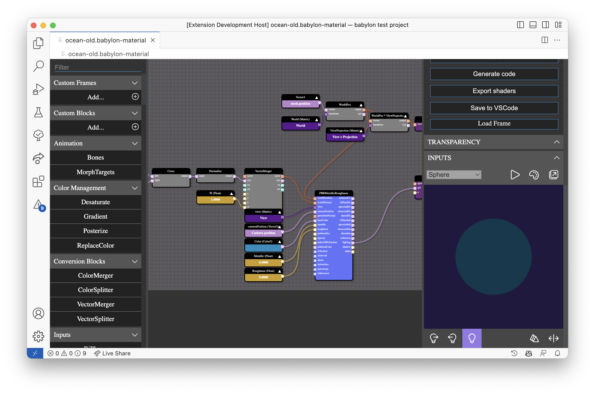

# VS-Code BabylonJS Material Editor Extension

Loads the [BabylonJS Material Editor](https://nme.babylonjs.com) as a custom editor for `.babylon-material` files.

## Debugging the extension

- Open this example in VS Code 1.46+
- `npm install`
- `npm run watch` or `npm run compile`
- `F5` to start debugging
